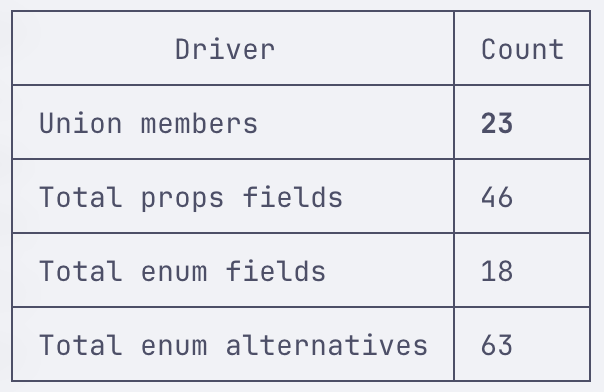

# Limitations Using Schemas With the Anthropic API

`2026-07-21` · [← Devlog](../index.md)

The Vercel AI SDK supports prescribing a schema that the LLM output needs to adhere to.

```typescript
const { output } = await generateText({
  model: anthropic('claude-haiku-4-5-20251001'),
  output: Output.object({
    //                    ┌─── An Effect Schema I wanted to constrain output to.
    //                    │
    //                    ▼
    schema: EffectSchema,
  }),
  system: buildSystemPrompt(),
  prompt: `${userContext}${logContext}`,
});
```

The expected format is a FlexibleSchema. An Effect Schema therefore needs to be converted into a format that satisfies this.

```typescript
type FlexibleSchema<SCHEMA = any> =
  Schema<SCHEMA> | LazySchema<SCHEMA> | ZodSchema<SCHEMA> | StandardSchema<SCHEMA>;
```

I had to fight a bit to get everything to work. There were a few red herrings, especially regarding how to [convert an Effect Schema into a type accepted by the AI SDK](https://x.com/lgrammel/status/1976644942425694511).

When passing a schema to the `output` parameter, the below worked. However, I settled on an alternative approach.

```typescript
const works = JsonSchema.toDocumentDraft07(Schema.toJsonSchemaDocument(testSchema)).schema;

const works = Schema.toJsonSchemaDocument(testSchema).schema;
```

## Satisfying the LLM

I then encountered a number of issues that prevented the LLM from producing _good_ output. The first issue seemed to be that the schema I was providing wasn't cohesive enough. It was too open-ended. For the LLM to perform successfully and return a meaningful output I needed to rework my schema to make it more _bounded_.

**LLM structured output cannot express open-ended maps**.

Before _bounding_ my schema, I continuously got empty output. For reference, the `Spec` is shaped like:

```typescript
{
	root: ElementId,
	elements: Record<ElementId, SpecElement>
}
```

However, I kept getting an empty `elements` entry back. Supposedly the LLM's difficulties were two-fold:

- Firstly, it could not make an association between elements in the map. I fixed this by ensuring each SpecElement had an id, an ElementId, that strengthened its association to other SpecElements and itself.
- Secondly, it could not determine how to construct something that was essentially boundless. `Record<ElementId, SpecElement>` allowed a boundless map of linked SpecElements. I fixed this by changing the data structure underlying the schema to use an Array: `Schema.Array(SpecElement)`.

The first fix, ensuring the SpecElements explicitly indexed each other.

```typescript
  public toSpecElements() {
    const specElements = this.catalogue.map((_) => {
        return Schema.Struct({
//                ┌─── LLM needed this to produce non-empty output
//                │
//                ▼
          id: ElementId,
          ...
        });
    });

    return Schema.Union(specElements);
  }
```

For the second fix, I needed a method to convert back to the canonical `Spec` format where the `elements` entry takes the shape `Record<ElementId, SpecElement>`.

But this was the least of my issues. When I finally got my Schema issue sorted, I encountered a new error on the side of the LLM.

### Satisfying Grammar Hard Limits

Apparently this is a [known issue](https://github.com/anthropics/anthropic-sdk-python/issues/1185). I didn't do much to solve this beyond pointing the agent at that issue and getting it to write a fix that worked for my schema.

```typescript
✘ [ERROR] Uncaught AI_APICallError: The compiled grammar is too large, which would cause performance issues. Simplify your tool schemas or reduce the number of strict tools. Error
  (file:///Users/jack.morris/Code/gen-ui-ne/node_modules/@ai-sdk/provider-utils/src/response-handler.ts:56:16)
```

13.06.2026 I have hit up against this issue again. This is after I increased the number of possible component primitives. The component catalogue schema completely blew out.



[Anthropic Constrained Decoding Nearly Unusable](../anthropic-constrained-decoding-nearly-unusable/index.md) speaks to this error in isolation.

### Satisfying Optional Parameters

```shell title="spec-selector.ts"
✘ [ERROR] Uncaught AI_APICallError: Schemas contains too many optional parameters (28), which would make grammar compilation inefficient. Reduce the number of optional parameters in your tool schemas (limit: 24).
```

This is another decoding constraint enforced by Anthropic. It is another example of the model setting a hard limit on how open ended the schema can be. I figure this is because an open-ended schema does not narrow the possibility of the models output enough to ensure that it doesn't _spin_ indefinitely.

```typescript
type GridPropsSchema = {
  readonly type: 'Grid';
  readonly columns: 2 | 1 | 3 | 4;
  readonly gap: 'sm' | 'md' | 'lg';
  //           ┌─ Property is optional
  //           ▼
  readonly children?: ReactNode;
};
```

Anthropic makes a tally of every optional property (parameter) included in the schema it is passed for decoding. A lot of my components had flexible API's. This meant optionality. I quickly went over Anthropics' quota.

> Anthropic caps optional parameters because each one adds a present/absent branch that multiplies the size of the grammar it compiles from your schema for constrained decoding, so the limit keeps that grammar cheap enough to compile and mask quickly — which is why converting defaulted enums to required (removing that branch) fixed it.
>
> _Claude_

The fix was to make my component schemas more definitive by redeclaring optional properties as being required.
