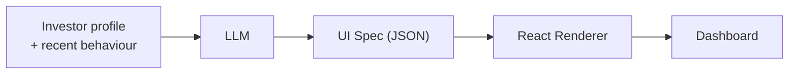
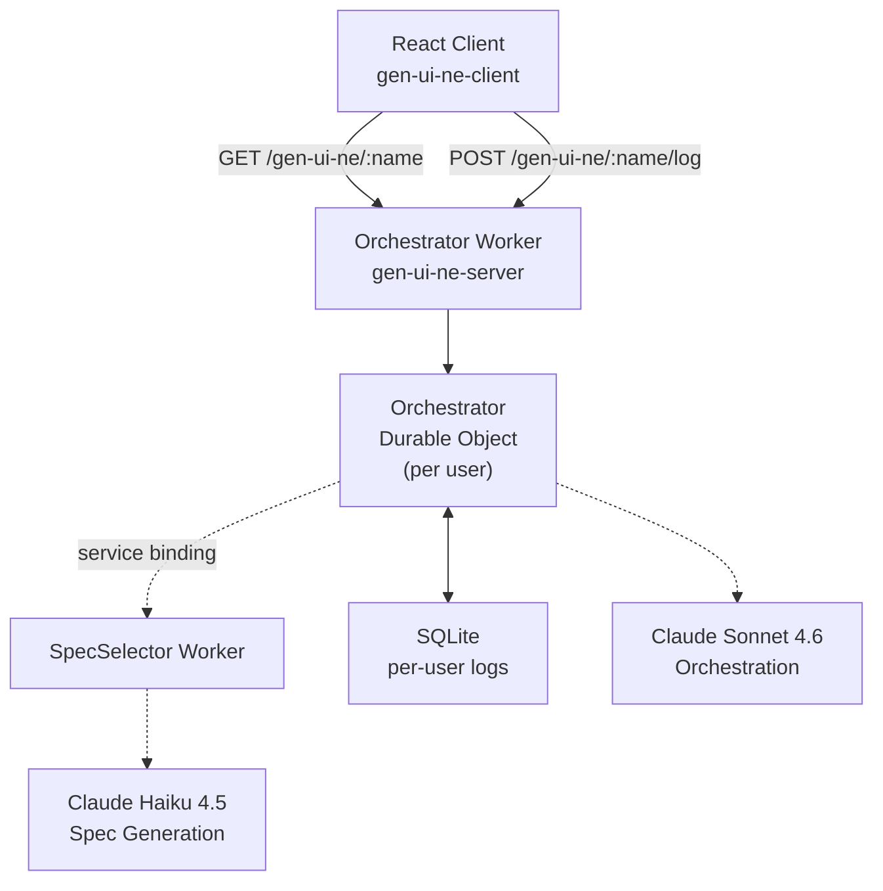
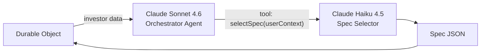
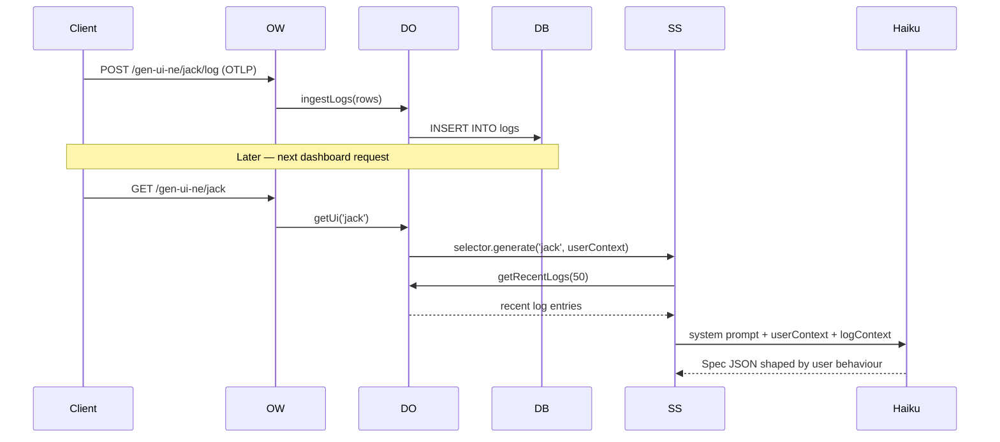
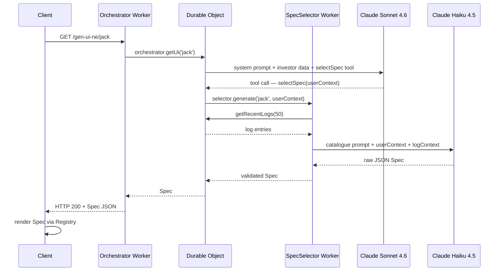

# gen-ui-ne

Generative UI for personalised investment dashboards

<div class="abs-br m-6 text-sm opacity-50">Architecture Overview</div>

---
layout: default
---

# Table of Contents

<Toc minDepth="1" maxDepth="1" />

---

# The Project

**gen-ui-ne** generates personalised investment dashboards for Sharesies.

Rather than hardcoding layouts, an LLM produces a **UI Spec** — a JSON data structure — tailored to each investor's portfolio, risk profile, and recent behaviour. A generic React renderer turns that spec into a live dashboard.

<br>



---

# High-Level Architecture



---

# The Spec

The Spec is the **contract between the LLM and the renderer** — a flat map of elements with a root pointer. Neither side knows about the other.

```json
{
  "root": "main",
  "elements": {
    "main": {
      "type": "Stack",
      "props": { "direction": "vertical", "gap": "lg" },
      "children": ["portfolio", "risk"]
    },
    "portfolio": {
      "type": "PortfolioValue",
      "props": { "value": "$12,450", "change": "+$240", "changePercent": "+2.0%", "direction": "positive" }
    },
    "risk": {
      "type": "RiskIndicator",
      "props": { "rating": 3, "label": "Moderate-Low" }
    }
  }
}
```

---
layout: section
---

# Cloudflare Architecture

Workers · Durable Objects · Service Bindings

---
level: 2
---

# Two Workers

The server is split into two Cloudflare Workers with distinct responsibilities, connected by a **service binding**.

| | Orchestrator Worker | SpecSelector Worker |
|---|---|---|
| **Entrypoint** | `index.ts` | `spec-selector.ts` |
| **Config** | `wrangler.jsonc` | `spec-selector.wrangler.jsonc` |
| **Role** | HTTP routing, DO lifecycle, LLM orchestration | LLM invocation, spec generation |
| **Model** | Claude Sonnet 4.6 | Claude Haiku 4.5 |

The `SPEC_SELECTOR` service binding lets the Orchestrator call the SpecSelector synchronously — no HTTP round-trip, no public URL.

---
level: 2
---

# Durable Objects

The `Orchestrator` Durable Object provides **per-user stateful compute** — one instance per user, namespaced by name.

```typescript
// HTTP layer: route each request to the right DO instance
const id = env.MY_DURABLE_OBJECT.idFromName(name)  // e.g. "jack", "rose"
const stub = env.MY_DURABLE_OBJECT.get(id)

// Inside the DO: SQLite per instance, created on first access
class Orchestrator extends DurableObject<Env> {
  constructor(ctx: DurableObjectState, env: Env) {
    super(ctx, env)
    this.ctx.storage.sql.exec(`
      CREATE TABLE IF NOT EXISTS logs (
        id INTEGER PRIMARY KEY AUTOINCREMENT,
        ts INTEGER NOT NULL, severity INTEGER NOT NULL,
        body TEXT NOT NULL, trace_id TEXT, span_id TEXT, attributes NOT NULL
      )
    `)
  }
}
```

Each DO instance is the coordination hub: it holds logs, runs the orchestrator LLM, and delegates to SpecSelector.

---
layout: section
---

# JSON Renderer

Registry · Schema · Catalogue · Renderer

---
level: 2
---

# The Registry

The Registry maps component type strings to React components, exposed as an **Effect service**.

```typescript
// gen-ui-ne-client/src/renderer/registry.ts
const components = {
  Stack:          () => import('./components/Stack'),
  Grid:           () => import('./components/Grid'),
  PortfolioValue: () => import('./components/PortfolioValue'),
  ReturnBadge:    () => import('./components/ReturnBadge'),
  AllocationBar:  () => import('./components/AllocationBar'),
  RiskIndicator:  () => import('./components/RiskIndicator'),
  HoldingRow:     () => import('./components/HoldingRow'),
  AutoInvestCard: () => import('./components/AutoInvestCard'),
  PromptCard:     () => import('./components/PromptCard'),
}
```

Lookups return `Option<ComponentType>` — unknown types degrade gracefully rather than throwing.

---
level: 2
---

# The Schema

All element types are defined as an **Effect Schema discriminated union** in `gen-ui-ne-shared`, shared between client and server.

```typescript
// gen-ui-ne-shared/domain.ts
const Element = Schema.Union(
  StackElement,          // { type: "Stack",          props: { direction, gap, align }, children }
  GridElement,           // { type: "Grid",            props: { columns, gap },         children }
  PortfolioValueElement, // { type: "PortfolioValue",  props: { value, change, ... }             }
  RiskIndicatorElement,  // { type: "RiskIndicator",   props: { rating, label }                  }
  // ...
)

const Spec = Schema.Struct({
  root:     Schema.String,
  elements: Schema.Record({ key: Schema.String, value: Element }),
})
```

The server validates the LLM's JSON output against this schema before returning it. The client uses it to type component props.

---
level: 2
---

# The Catalogue

The Catalogue is a **runtime inventory of all renderable components**, used to build the LLM's system prompt at request time.

```typescript
// gen-ui-ne-shared/catalogue.ts
export const catalogue: Record<ElementType, ComponentEntry> = {
  PortfolioValue: {
    description: "Displays the investor's total portfolio value with a change amount and percentage. "
                 + "Use at the top of a dashboard to give an at-a-glance financial overview.",
    example: { value: "$12,340.00", change: "+$120.00", changePercent: "+0.98%", direction: "positive" },
  },
  RiskIndicator: {
    description: "Displays the investor's risk rating on a 1–7 scale. "
                 + "Use to surface or reinforce risk profile awareness, especially when recommending funds.",
    example: { rating: 4, label: "Medium" },
  },
  // ...9 components total
}
```

Adding a new component to the catalogue automatically makes it available to the LLM — no prompt editing required.

---
level: 2
---

# The Renderer

The renderer recursively walks the Spec tree from `root`, looks up each type in the Registry, and renders it.

```typescript
// gen-ui-ne-client/src/renderer/renderer.tsx
function renderElement(id: string, spec: Spec): ReactNode {
  const element = spec.elements[id]
  const Component = registry.lookup(element.type) // Option<ComponentType>

  if (Option.isNone(Component)) return null

  const children = element.children?.map(childId => renderElement(childId, spec))

  return <Component.value {...element.props}>{children}</Component.value>
}

export function Renderer({ spec }: { spec: Spec }) {
  return renderElement(spec.root, spec)
}
```

No hardcoded layouts. The entire dashboard is data-driven from the JSON spec.

---
layout: section
---

# LLM Orchestration

Two Agents · Tool Calling · Adaptive Context

---
level: 2
---

# Two-Agent Pattern

Two LLMs with different roles — each doing what it does best.



**Sonnet** reasons about the investor context and decides *what kind of dashboard* to ask for — it produces a rich natural-language description.

**Haiku** is fast and focused: given that description plus the component catalogue, it outputs the JSON spec directly.

---
level: 2
---

# The Orchestrator Agent

Claude Sonnet 4.6, running inside the Durable Object. Its job is narrow: understand the investor and invoke `selectSpec`.

```typescript
const result = await generateText({
  model: anthropic('claude-sonnet-4-6'),
  system: `You are the orchestrator for a personalised investment dashboard called Sharesies.
           When asked to render a user's dashboard, call selectSpec with a clear description
           of their investment context.`,
  prompt: `Render the dashboard for "${name}". Data: ${userData[name]}`,
  tools: {
    selectSpec: tool({
      description: 'Generate a personalised UI spec for an investor based on their context',
      inputSchema: jsonSchema<{ userContext: string }>({ ... }),
      execute: async ({ userContext }) => selector.generate(name, userContext),
    }),
  },
  stopWhen: hasToolCall('selectSpec'),  // stop as soon as the tool is called
})
```

---
level: 2
---

# The Spec Selector

Claude Haiku 4.5, running in the dedicated SpecSelector Worker. Its system prompt is **dynamically built from the catalogue**.

```typescript
function buildSystemPrompt() {
  const components = Object.entries(catalogue)
    .map(([type, entry]) => {
      const schema = `{"type":"${type}","props":${JSON.stringify(entry.example)}}`
      return `- ${type}: ${entry.description}\n  Schema: ${schema}`
    })
    .join('\n')

  return [
    'You are a UI spec generator for a personalised investment dashboard called Sharesies.',
    'Respond with ONLY a raw JSON object (no markdown, no code fences).',
    // ...validation rules
    'Available components:',
    components,
  ].join('\n')
}
```

The prompt also receives `logContext` — up to 50 recent client log entries from the DO's SQLite — so the spec can adapt to what the user has been doing.

---

# The Logging Feedback Loop

Client logs flow back into the LLM's context, enabling **adaptive spec generation** over time.



---

# End-to-End Request Flow



---

# Key Design Decisions

<div class="grid grid-cols-2 gap-6 mt-4">
<div>

**JSON Spec over generated code**

The LLM outputs a data structure, not React. This is safer, validatable against a schema, and decouples model versioning from the frontend entirely.

**Two agents over one**

Sonnet handles open-ended reasoning; Haiku handles fast, constrained JSON output. Each model does what it is best at, and the two-worker split isolates LLM latency from HTTP concerns.

</div>
<div>

**Durable Objects over KV**

Per-user SQLite enables structured, queryable log storage. DO instances also provide a natural namespace and eliminate coordination overhead between requests for the same user.

**Catalogue-driven prompts**

The LLM's system prompt is derived from the live component catalogue, not hand-written. Adding a component to the catalogue automatically makes it available to the spec generator.

</div>
</div>
